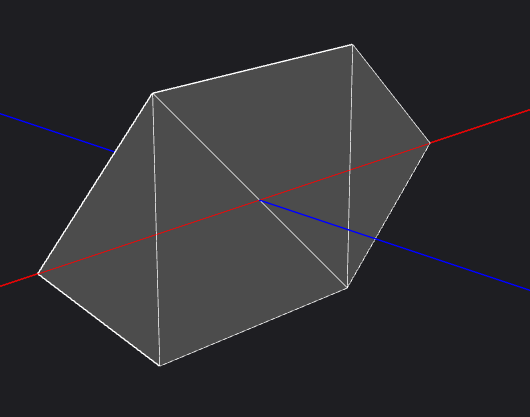

Delaunay Triangluation

The algorithm for delaunay triangulation used in this project is the Bowyer Watson algorithm. (https://en.wikipedia.org/wiki/Bowyer%E2%80%93Watson_algorithm)

Example images:




How the project works:

Gets the points for the triangulation and sorts them by x

Computes the triangles for the mesh using the Bowyer Watson algorithm, BUT does not form the faces of the mesh yet.

When all triangles are computed, then the faces are added (To keep OpenMesh happy :))

Setup:
```
include/triangle.h
include/edge.h
include/delaunay.h
```

main.cpp provides the following test cases. 

A simple mesh that is this (simple.obj):
  /|---|\
 / | \ | \
 \ |  \| /
  \|---|/

A random mesh containing 10 points (random.obj)

A random mesh containing 100 points (large_random.obj)

Compiling

I tested this using the Visual Studio 2017 compiler with c++17 enabled.

I have edited the main CMakeLists.txt of OpenMesh to enable c++17 and disable Qt

To compile this project, you can either 1) Compile using inbuilt visual studio 2017 CMakeLists.txt or 2) use cmake to compile the program

1)

Open visual studio 2017

Go to File > Open > CMake...

Then select the folder that contains OpenMesh

Let the solution compile

Go to Select Startup button and select Delaunay

Press F5 to compile and the objs should be generated

2)

*not tested

Go to base of OpenMesh

mkdir build

cd build

cmake ..

make

Difficulities ran into:

Compiling OpenMesh (Kept on saying Qt was not found, so I disabled that)

OpenMesh API (Lack of many examples. Didn't know you had to add faces in CCW or else the mesh would break. Originally the program computed the points and added faces (representing triangles) as it was going, but that didn't work out since OpenMesh wasn't happy.)


